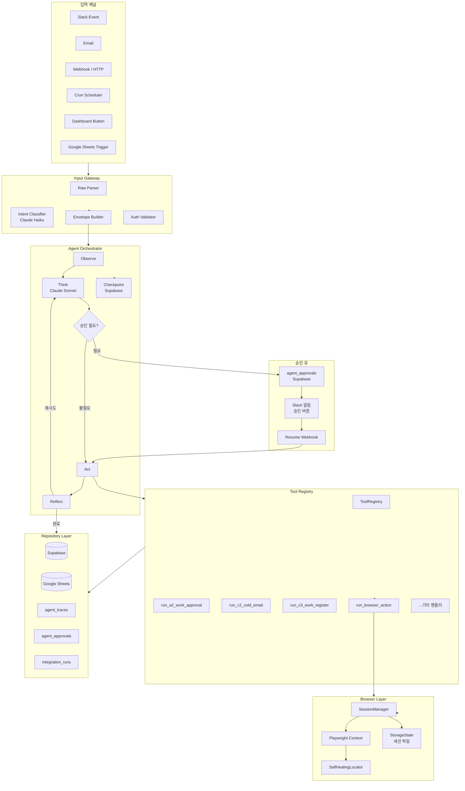
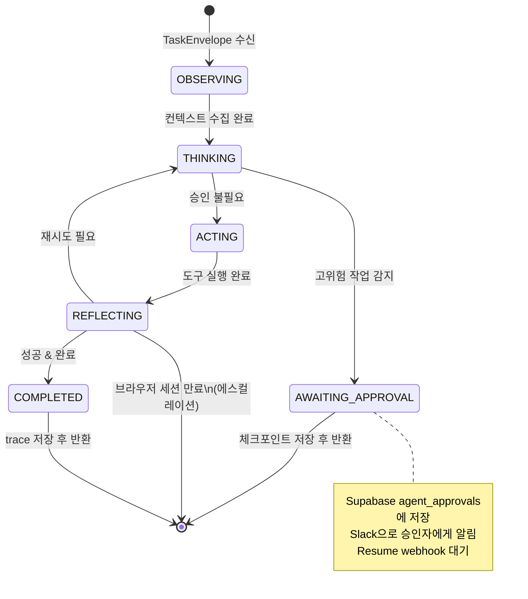
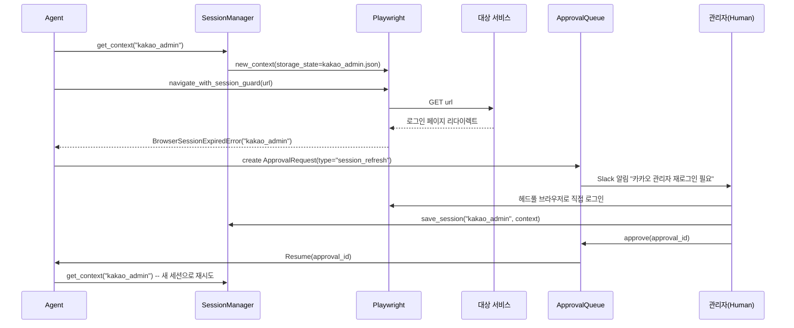
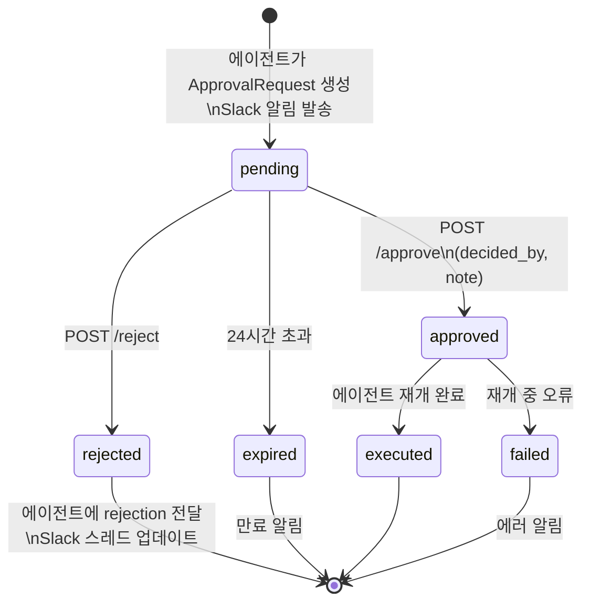
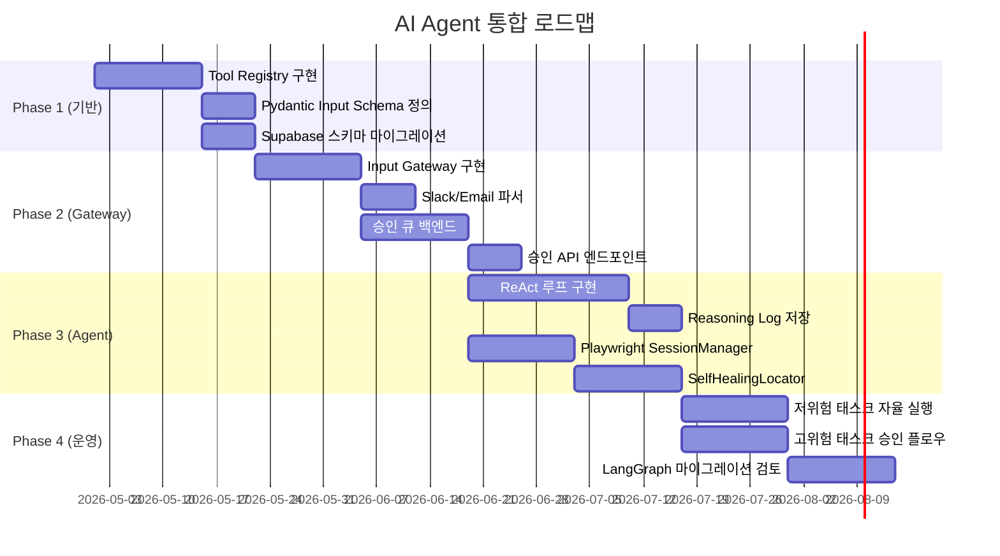

# AI Agent 업무 자동화 시스템 — 상세 구현 플랜

> 기준 문서: `docs/ai_agent_architecture.md`  
> 작성일: 2026-04-28  
> 대상 코드베이스: `rhoonart-rpa` (handlers A-2 ~ D-3, dashboard runner, Supabase repository 스텁 완비)

---

## 목차

1. [전체 아키텍처 개요](#1-전체-아키텍처-개요)
2. [Input Gateway 상세 설계](#2-input-gateway-상세-설계)
3. [에이전트 런타임 (ReAct 루프)](#3-에이전트-런타임-react-루프)
4. [Playwright 브라우저 제어 및 세션 관리](#4-playwright-브라우저-제어-및-세션-관리)
5. [Tool Registry — Pydantic 기반 레지스트리 패턴](#5-tool-registry--pydantic-기반-레지스트리-패턴)
6. [Supabase 스키마 — 에이전트 Traces 및 승인 데이터](#6-supabase-스키마--에이전트-traces-및-승인-데이터)
7. [승인 큐 시스템 (Human-in-the-Loop 백엔드)](#7-승인-큐-시스템-human-in-the-loop-백엔드)
8. [셀렉터 자가 복구 메커니즘 (Self-Healing Selector)](#8-셀렉터-자가-복구-메커니즘-self-healing-selector)
9. [단계적 통합 전략 (기존 모듈과 공존)](#9-단계적-통합-전략-기존-모듈과-공존)
10. [구현 우선순위 로드맵](#10-구현-우선순위-로드맵)

---

## 1. 전체 아키텍처 개요



**핵심 설계 원칙**

| 원칙 | 적용 |
|------|------|
| AI는 결정, 핸들러는 실행 | 기존 `src/handlers/*.py` 무수정 재사용 |
| 실패는 상태로 표현 | `BrowserSessionExpiredError`, `ApprovalPending` 등 typed exception |
| 영속성은 Supabase | 체크포인트, 트레이스, 승인 모두 단일 DB |
| 드라이런이 기본값 | 모든 Tool `dry_run=True` 가 기본 |

---

## 2. Input Gateway 상세 설계

### 2-1. 데이터 구조 — Normalized Task Envelope

```python
# src/agents/gateway/models.py
from __future__ import annotations

from datetime import datetime
from enum import Enum
from typing import Any
from uuid import uuid4

from pydantic import BaseModel, Field


class SourceType(str, Enum):
    SLACK = "slack"
    EMAIL = "email"
    WEBHOOK = "webhook"
    CRON = "cron"
    DASHBOARD = "dashboard"
    SHEETS = "sheets"
    FORM = "form"


class RiskLevel(str, Enum):
    LOW = "low"        # 읽기 전용 / 시트 조회
    MEDIUM = "medium"  # 시트 쓰기 / Slack 알림
    HIGH = "high"      # 이메일 발송 / Drive 권한 변경
    CRITICAL = "critical"  # 대량 발송 / 외부 시스템 상태 변경


class AuthContext(BaseModel):
    source_verified: bool = False
    actor_id: str = ""          # Slack user_id, email sender, etc.
    actor_name: str = ""
    is_admin: bool = False


class TaskEnvelope(BaseModel):
    envelope_id: str = Field(default_factory=lambda: f"env-{uuid4().hex[:12]}")
    trace_id: str = Field(default_factory=lambda: f"tr-{uuid4().hex[:16]}")
    source_type: SourceType
    source_id: str                       # Slack channel_id, email address 등
    received_at: datetime = Field(default_factory=datetime.utcnow)

    # 분류 결과
    intent: str                          # "approve_work_request", "send_cold_email" 등
    confidence: float = 1.0              # AI 분류 신뢰도 (0.0~1.0)
    task_id: str                         # "A-2", "C-2" 등 매핑된 태스크

    # 실행 파라미터
    payload: dict[str, Any] = Field(default_factory=dict)
    risk_level: RiskLevel = RiskLevel.MEDIUM
    requires_human_review: bool = False
    dry_run: bool = True

    # 메타
    auth_context: AuthContext = Field(default_factory=AuthContext)
    raw_event: dict[str, Any] = Field(default_factory=dict)  # 원본 이벤트 보존
    ttl_seconds: int = 3600
```

### 2-2. 소스별 파서

```python
# src/agents/gateway/parsers.py
import re
from .models import TaskEnvelope, SourceType, RiskLevel, AuthContext


class SlackEventParser:
    """Slack Events API 페이로드 → TaskEnvelope"""

    # A-2 메시지 포맷: 채널: "채널명" 신규 영상 사용 요청이 있습니다.\n작품명
    _A2_PATTERN = re.compile(r'채널:\s*"(.+?)"\s*신규 영상 사용 요청', re.MULTILINE)

    def parse(self, raw: dict) -> TaskEnvelope:
        event = raw.get("event", {})
        text = event.get("text", "")

        intent, task_id, payload = self._classify(text, event)

        return TaskEnvelope(
            source_type=SourceType.SLACK,
            source_id=event.get("channel", ""),
            intent=intent,
            task_id=task_id,
            payload=payload,
            risk_level=RiskLevel.HIGH if task_id == "A-2" else RiskLevel.MEDIUM,
            requires_human_review=False,
            raw_event=raw,
            auth_context=AuthContext(
                source_verified=True,  # Slack signing secret 검증 완료 가정
                actor_id=event.get("user", ""),
            ),
        )

    def _classify(self, text: str, event: dict) -> tuple[str, str, dict]:
        if self._A2_PATTERN.search(text):
            lines = text.strip().splitlines()
            m = self._A2_PATTERN.search(lines[0])
            channel_name = m.group(1) if m else ""
            work_title = lines[1].strip() if len(lines) > 1 else ""
            return (
                "approve_work_request",
                "A-2",
                {
                    "channel_name": channel_name,
                    "work_title": work_title,
                    "slack_channel_id": event.get("channel", ""),
                    "slack_message_ts": event.get("ts", ""),
                },
            )
        # 분류 불가 → AI 분류기로 위임
        return "unknown", "UNKNOWN", {"raw_text": text}


class EmailParser:
    """수신 이메일 → TaskEnvelope"""

    def parse(self, raw: dict) -> TaskEnvelope:
        subject = raw.get("subject", "")
        body = raw.get("body", "")
        sender = raw.get("from", "")

        # 신뢰할 수 있는 발신자 도메인 화이트리스트
        trusted = any(
            sender.endswith(d) for d in ["@rhoonart.com", "@trusted-partner.com"]
        )

        return TaskEnvelope(
            source_type=SourceType.EMAIL,
            source_id=sender,
            intent="unknown",        # AI 분류기가 처리
            task_id="UNKNOWN",
            payload={"subject": subject, "body": body, "sender": sender},
            risk_level=RiskLevel.MEDIUM,
            requires_human_review=not trusted,
            raw_event=raw,
            auth_context=AuthContext(
                source_verified=trusted,
                actor_id=sender,
            ),
        )


class WebhookParser:
    """HTTP POST JSON → TaskEnvelope"""

    _TASK_INTENT_MAP = {
        "A-2": "approve_work_request",
        "A-3": "naver_clip_monthly",
        "B-2": "weekly_report",
        "C-1": "lead_discovery",
        "C-2": "cold_email_send",
        "C-3": "work_register",
        "C-4": "coupon_notification",
        "D-2": "relief_request",
        "D-3": "kakao_onboarding",
    }

    def parse(self, raw: dict, task_id: str = "") -> TaskEnvelope:
        tid = task_id.upper()
        intent = self._TASK_INTENT_MAP.get(tid, "unknown")
        return TaskEnvelope(
            source_type=SourceType.WEBHOOK,
            source_id=raw.get("source_id", "http"),
            intent=intent,
            task_id=tid,
            payload=raw.get("payload", raw),
            dry_run=raw.get("dry_run", True),
            raw_event=raw,
            auth_context=AuthContext(source_verified=True),
        )
```

### 2-3. AI 기반 Intent Classifier (모호한 입력 처리)

```python
# src/agents/gateway/intent_classifier.py
from anthropic import Anthropic

KNOWN_INTENTS = {
    "approve_work_request": "A-2",
    "naver_clip_monthly": "A-3",
    "weekly_report": "B-2",
    "lead_discovery": "C-1",
    "cold_email_send": "C-2",
    "work_register": "C-3",
    "coupon_notification": "C-4",
    "relief_request": "D-2",
    "kakao_onboarding": "D-3",
}

SYSTEM_PROMPT = """\
루나르트 RPA 시스템의 인텐트 분류기야.
사용자의 자연어 입력을 보고 아래 중 가장 적합한 intent 하나를 JSON으로 반환해.
가능한 intent: {intents}
형식: {{"intent": "intent_name", "confidence": 0.0~1.0, "extracted": {{...}}}}
불확실하면 confidence를 0.5 미만으로 설정해.\
""".format(intents=list(KNOWN_INTENTS.keys()))


class IntentClassifier:
    def __init__(self) -> None:
        self._client = Anthropic()

    def classify(self, text: str) -> tuple[str, float, dict]:
        """(intent, confidence, extracted_payload) 반환"""
        import json

        resp = self._client.messages.create(
            model="claude-3-haiku-20240307",
            max_tokens=200,
            system=SYSTEM_PROMPT,
            messages=[{"role": "user", "content": text}],
        )
        try:
            result = json.loads(resp.content[0].text)
            return (
                result.get("intent", "unknown"),
                float(result.get("confidence", 0.0)),
                result.get("extracted", {}),
            )
        except Exception:
            return "unknown", 0.0, {}
```

### 2-4. Gateway 진입점 통합

```python
# src/agents/gateway/gateway.py

class InputGateway:
    """모든 소스의 진입을 단일 EnvelopeFactory로 정규화."""

    def __init__(self) -> None:
        self._slack = SlackEventParser()
        self._email = EmailParser()
        self._webhook = WebhookParser()
        self._classifier = IntentClassifier()

    def ingest(self, source_type: SourceType, raw: dict, **kwargs) -> TaskEnvelope:
        match source_type:
            case SourceType.SLACK:
                envelope = self._slack.parse(raw)
            case SourceType.EMAIL:
                envelope = self._email.parse(raw)
            case SourceType.WEBHOOK:
                envelope = self._webhook.parse(raw, kwargs.get("task_id", ""))
            case _:
                raise ValueError(f"Unsupported source_type: {source_type}")

        # intent가 unknown이면 AI 분류기 위임
        if envelope.intent == "unknown" and envelope.payload.get("raw_text"):
            intent, confidence, extracted = self._classifier.classify(
                envelope.payload["raw_text"]
            )
            # model_copy: frozen pydantic v2
            envelope = envelope.model_copy(update={
                "intent": intent,
                "confidence": confidence,
                "task_id": KNOWN_INTENTS.get(intent, "UNKNOWN"),
                "payload": {**envelope.payload, **extracted},
            })

        return envelope
```

---

## 3. 에이전트 런타임 (ReAct 루프)

### 3-1. 기술 스택 선택 근거

**결정: 커스텀 ReAct 루프 (LangGraph/AutoGen 미사용)**

| 비교 항목 | LangGraph | AutoGen | 커스텀 루프 (선택) |
|-----------|-----------|---------|-----------------|
| 기존 핸들러 재사용 | 래핑 필요 | 래핑 필요 | 그대로 사용 |
| Supabase 체크포인트 | 커스텀 구현 필요 | 미지원 | 직접 제어 |
| 승인 Pause/Resume | StateGraph로 가능하나 복잡 | 미지원 | 명확한 상태 머신 |
| 디버깅 용이성 | 낮음 (프레임워크 추상화) | 낮음 | 높음 |
| 도입 복잡도 | 높음 (새 개념 다수) | 매우 높음 | 낮음 |
| Phase 3 업그레이드 | 가능 | 가능 | LangGraph 마이그레이션 용이 |

**LangGraph 도입 시점**: Phase 3 — 멀티 에이전트(오케스트레이터 + 서브 에이전트) 구조가 필요해지는 시점에 도입.

### 3-2. 에이전트 상태 모델

```python
# src/agents/runtime/models.py
from __future__ import annotations

from dataclasses import dataclass, field
from datetime import datetime
from enum import Enum
from typing import Any


class AgentState(str, Enum):
    OBSERVING = "observing"
    THINKING = "thinking"
    AWAITING_APPROVAL = "awaiting_approval"
    ACTING = "acting"
    REFLECTING = "reflecting"
    COMPLETED = "completed"
    FAILED = "failed"


@dataclass
class Observation:
    envelope: dict[str, Any]
    prior_runs: list[dict[str, Any]]        # 최근 동일 태스크 실행 기록
    tool_capabilities: list[str]            # 사용 가능한 도구 목록


@dataclass
class Thought:
    reasoning: str                          # LLM의 사고 과정 (→ agent_traces 저장)
    selected_tool: str
    tool_input: dict[str, Any]
    requires_approval: bool
    approval_reason: str = ""
    risk_level: str = "medium"
    confidence: float = 1.0


@dataclass
class ActionResult:
    tool_name: str
    input_used: dict[str, Any]
    output: dict[str, Any]
    success: bool
    error: str = ""
    duration_ms: int = 0


@dataclass
class Reflection:
    is_complete: bool
    needs_retry: bool
    retry_reason: str = ""
    next_tool: str = ""
    summary: str = ""
    final_result: dict[str, Any] = field(default_factory=dict)


@dataclass
class AgentTrace:
    trace_id: str
    task_id: str
    envelope_id: str
    steps: list[dict[str, Any]] = field(default_factory=list)
    started_at: datetime = field(default_factory=datetime.utcnow)

    def record(self, state: AgentState, data: Any) -> None:
        self.steps.append({
            "state": state.value,
            "timestamp": datetime.utcnow().isoformat(),
            "data": data if isinstance(data, dict) else vars(data),
        })
```

### 3-3. ReAct 루프 구현

```python
# src/agents/runtime/agent.py
from __future__ import annotations

import time
from typing import Any, Callable

from anthropic import Anthropic

from .models import (
    AgentState, AgentTrace, Observation, Thought,
    ActionResult, Reflection,
)
from ..tools.registry import ToolRegistry
from ..approval.queue import ApprovalQueue, ApprovalRequest
from ...dashboard.models import ExecutionMode

MAX_STEPS = 8
THINK_MODEL = "claude-3-5-sonnet-20241022"

SYSTEM_PROMPT = """\
당신은 루나르트 RPA 에이전트입니다. 주어진 TaskEnvelope를 보고
적절한 도구(Tool)를 선택하여 업무를 자동화합니다.

규칙:
1. 항상 JSON 형식으로 응답합니다.
2. 고위험 작업(이메일 발송, Drive 권한 변경)은 requires_approval=true로 표시합니다.
3. 불확실하면 dry_run=true를 유지합니다.
4. 실패 원인을 구체적으로 기록합니다.

응답 형식:
{
  "reasoning": "왜 이 도구를 선택했는지 상세 설명",
  "selected_tool": "tool_name",
  "tool_input": {...},
  "requires_approval": false,
  "approval_reason": "",
  "confidence": 0.95
}
"""


class RhoArtAgent:
    def __init__(
        self,
        tool_registry: ToolRegistry,
        approval_queue: ApprovalQueue,
        trace_repo: Any,  # IAgentTraceRepository
    ) -> None:
        self._tools = tool_registry
        self._approvals = approval_queue
        self._trace_repo = trace_repo
        self._llm = Anthropic()

    async def run(self, envelope: dict[str, Any]) -> dict[str, Any]:
        trace = AgentTrace(
            trace_id=envelope["trace_id"],
            task_id=envelope["task_id"],
            envelope_id=envelope["envelope_id"],
        )
        state = AgentState.OBSERVING
        observation = thought = action_result = None

        try:
            for step in range(MAX_STEPS):
                if state == AgentState.OBSERVING:
                    observation = await self._observe(envelope, trace)
                    state = AgentState.THINKING

                elif state == AgentState.THINKING:
                    thought = await self._think(envelope, observation, trace)
                    if thought.requires_approval:
                        return await self._pause_for_approval(thought, trace, envelope)
                    state = AgentState.ACTING

                elif state == AgentState.ACTING:
                    action_result = await self._act(thought, trace)
                    state = AgentState.REFLECTING

                elif state == AgentState.REFLECTING:
                    reflection = await self._reflect(action_result, trace)
                    if reflection.is_complete:
                        trace.record(AgentState.COMPLETED, reflection.final_result)
                        await self._save_trace(trace)
                        return {"success": True, "result": reflection.final_result, "trace_id": trace.trace_id}
                    if not reflection.needs_retry:
                        break
                    # 재시도: 다음 도구 선택
                    thought = thought  # reflection.next_tool로 갱신 가능
                    state = AgentState.THINKING

            raise RuntimeError(f"MAX_STEPS({MAX_STEPS}) 초과")

        except Exception as exc:
            trace.record(AgentState.FAILED, {"error": str(exc)})
            await self._save_trace(trace)
            raise

    async def _observe(self, envelope: dict, trace: AgentTrace) -> Observation:
        prior_runs = await self._trace_repo.get_recent(
            task_id=envelope["task_id"], limit=3
        )
        obs = Observation(
            envelope=envelope,
            prior_runs=prior_runs,
            tool_capabilities=self._tools.describe_all(),
        )
        trace.record(AgentState.OBSERVING, {"prior_runs_count": len(prior_runs)})
        return obs

    async def _think(
        self, envelope: dict, obs: Observation, trace: AgentTrace
    ) -> Thought:
        import json

        context = {
            "task_id": envelope["task_id"],
            "intent": envelope["intent"],
            "payload": envelope["payload"],
            "available_tools": obs.tool_capabilities,
            "prior_run_outcomes": [r.get("status") for r in obs.prior_runs],
        }
        resp = self._llm.messages.create(
            model=THINK_MODEL,
            max_tokens=1024,
            system=SYSTEM_PROMPT,
            messages=[{"role": "user", "content": json.dumps(context, ensure_ascii=False)}],
        )
        raw = json.loads(resp.content[0].text)
        thought = Thought(
            reasoning=raw["reasoning"],
            selected_tool=raw["selected_tool"],
            tool_input=raw["tool_input"],
            requires_approval=raw.get("requires_approval", False),
            approval_reason=raw.get("approval_reason", ""),
            confidence=raw.get("confidence", 1.0),
        )
        # ★ Reasoning Log — 역추적의 핵심
        trace.record(AgentState.THINKING, {
            "reasoning": thought.reasoning,
            "selected_tool": thought.selected_tool,
            "requires_approval": thought.requires_approval,
            "confidence": thought.confidence,
        })
        return thought

    async def _act(self, thought: Thought, trace: AgentTrace) -> ActionResult:
        tool_fn = self._tools.get(thought.selected_tool)
        start = time.monotonic()
        try:
            output = await tool_fn(thought.tool_input)
            result = ActionResult(
                tool_name=thought.selected_tool,
                input_used=thought.tool_input,
                output=output,
                success=True,
                duration_ms=int((time.monotonic() - start) * 1000),
            )
        except Exception as exc:
            result = ActionResult(
                tool_name=thought.selected_tool,
                input_used=thought.tool_input,
                output={},
                success=False,
                error=str(exc),
                duration_ms=int((time.monotonic() - start) * 1000),
            )
        trace.record(AgentState.ACTING, vars(result))
        return result

    async def _reflect(self, result: ActionResult, trace: AgentTrace) -> Reflection:
        if not result.success:
            # 브라우저 세션 만료 감지 → 승인 요청으로 에스컬레이션
            if "BrowserSessionExpired" in result.error:
                reflection = Reflection(
                    is_complete=False,
                    needs_retry=False,
                    summary=f"브라우저 세션 만료: {result.tool_name}. 관리자 재인증 필요.",
                )
            else:
                reflection = Reflection(
                    is_complete=False,
                    needs_retry=True,
                    retry_reason=result.error,
                )
        else:
            reflection = Reflection(
                is_complete=True,
                needs_retry=False,
                final_result=result.output,
                summary=f"{result.tool_name} 완료 ({result.duration_ms}ms)",
            )
        trace.record(AgentState.REFLECTING, vars(reflection))
        return reflection

    async def _pause_for_approval(
        self, thought: Thought, trace: AgentTrace, envelope: dict
    ) -> dict[str, Any]:
        """승인 대기 — 상태를 Supabase에 저장하고 즉시 반환."""
        checkpoint = {
            "trace_id": trace.trace_id,
            "envelope": envelope,
            "pending_thought": vars(thought),
            "trace_steps": trace.steps,
        }
        approval_id = await self._approvals.create(
            ApprovalRequest(
                trace_id=trace.trace_id,
                task_id=envelope["task_id"],
                summary=thought.approval_reason or f"{thought.selected_tool} 실행 승인 요청",
                risk_level=thought.risk_level,
                preview=thought.tool_input,
                checkpoint=checkpoint,
            )
        )
        trace.record(AgentState.AWAITING_APPROVAL, {"approval_id": approval_id})
        await self._save_trace(trace)
        return {
            "success": False,
            "status": "awaiting_approval",
            "approval_id": approval_id,
            "message": f"승인 요청 생성됨: {approval_id}",
        }

    async def _save_trace(self, trace: AgentTrace) -> None:
        await self._trace_repo.save(trace)
```

### 3-4. ReAct 루프 흐름도



---

## 4. Playwright 브라우저 제어 및 세션 관리

### 4-1. 설계 판단: BrowserContext + StorageState 재사용 채택

**문제**: 카카오 관리자, YouTube Studio 등은 세션 만료가 잦고 재인증이 복잡.  
**해결책**: `playwright.async_api.BrowserContext.storage_state()`를 파일로 영속화.

```
browser_sessions/
├── kakao_admin.json      # 카카오 관리자 로그인 상태
├── youtube_studio.json   # YouTube Studio 로그인 상태
└── naver_clip.json       # 네이버 클립 관리자
```

이 파일들은 `.gitignore`에 추가하고, 배포 환경에서는 Supabase Storage 또는 AWS Secrets Manager로 관리.

### 4-2. SessionManager 구현

```python
# src/agents/browser/session_manager.py
from __future__ import annotations

import json
from pathlib import Path
from typing import Any

from playwright.async_api import async_playwright, BrowserContext, Page


SESSION_DIR = Path("browser_sessions")

# 서비스별 로그인 감지 URL 패턴
LOGIN_INDICATORS: dict[str, list[str]] = {
    "kakao_admin": ["accounts.kakao.com/login", "로그인"],
    "youtube_studio": ["accounts.google.com", "studio.youtube.com/channel/UC"],
    "naver_clip": ["nid.naver.com/nidlogin"],
}


class BrowserSessionExpiredError(Exception):
    """에이전트가 이 오류를 감지하면 재인증 승인 요청을 생성한다."""
    def __init__(self, service: str) -> None:
        super().__init__(f"BrowserSessionExpired:{service}")
        self.service = service


class SessionManager:
    def __init__(self, headless: bool = True) -> None:
        self._headless = headless
        SESSION_DIR.mkdir(exist_ok=True)

    def _session_path(self, service: str) -> Path:
        return SESSION_DIR / f"{service}.json"

    def _has_session(self, service: str) -> bool:
        return self._session_path(service).is_file()

    async def get_context(self, service: str) -> tuple[Any, BrowserContext]:
        """playwright 인스턴스와 Context를 반환. 세션 파일이 있으면 재사용."""
        pw = await async_playwright().start()
        browser = await pw.chromium.launch(headless=self._headless)

        if self._has_session(service):
            context = await browser.new_context(
                storage_state=str(self._session_path(service))
            )
        else:
            context = await browser.new_context()

        return pw, context

    async def save_session(self, service: str, context: BrowserContext) -> None:
        """로그인 완료 후 세션 저장."""
        state = await context.storage_state()
        self._session_path(service).write_text(json.dumps(state))

    async def check_session_valid(self, page: Page, service: str) -> bool:
        """현재 페이지가 로그인 상태인지 확인."""
        url = page.url
        content = await page.content()
        indicators = LOGIN_INDICATORS.get(service, [])
        for indicator in indicators:
            if indicator in url or indicator in content:
                return False
        return True

    async def navigate_with_session_guard(
        self, page: Page, url: str, service: str
    ) -> None:
        """세션 만료 감지 시 BrowserSessionExpiredError 발생."""
        await page.goto(url, wait_until="networkidle")
        if not await self.check_session_valid(page, service):
            raise BrowserSessionExpiredError(service)
```

### 4-3. 헤드리스 / 헤드풀 선택 기준

```python
# src/agents/browser/browser_factory.py

class HeadlessPolicy:
    """실행 환경과 목적에 따라 headless 여부 자동 결정."""

    @staticmethod
    def should_be_headless(purpose: str, env: str = "production") -> bool:
        """
        headful 선택 조건:
        - purpose == "auth_setup": 최초 로그인 세션 생성
        - purpose == "debug": 디버깅
        - env == "local" AND purpose == "dev_test"
        """
        if purpose in ("auth_setup", "debug"):
            return False
        if env == "local" and purpose == "dev_test":
            return False
        return True
```

### 4-4. 세션 갱신 플로우



---

## 5. Tool Registry — Pydantic 기반 레지스트리 패턴

### 5-1. 설계 판단: Pydantic Schema 기반 자기 기술(Self-Describing) 채택

에이전트가 도구를 선택할 때 "무엇을 할 수 있고 어떤 인자가 필요한지"를 LLM에 자동 제공하기 위해, 각 Tool은 Pydantic 모델로 입력 스키마를 정의한다. 이를 통해:
- **LLM 컨텍스트 자동 생성**: `model_json_schema()` → LLM 프롬프트에 삽입
- **자동 유효성 검사**: `model_validate(raw_input)` → 타입 오류 조기 차단
- **문서 자동화**: schema의 `description` 필드가 곧 Tool 사용 설명서

```python
# src/agents/tools/registry.py
from __future__ import annotations

import asyncio
import functools
from typing import Any, Callable

from pydantic import BaseModel, Field

from ...dashboard.models import ExecutionMode


class RiskLevel(str):
    LOW = "low"
    MEDIUM = "medium"
    HIGH = "high"
    CRITICAL = "critical"


class ToolSpec(BaseModel):
    name: str
    description: str
    input_model: type[BaseModel]
    risk_level: str = "medium"
    requires_approval: bool = False
    supports_dry_run: bool = True
    tags: list[str] = Field(default_factory=list)

    def to_llm_description(self) -> dict[str, Any]:
        """LLM 프롬프트에 삽입할 도구 설명 생성."""
        return {
            "name": self.name,
            "description": self.description,
            "risk_level": self.risk_level,
            "requires_approval": self.requires_approval,
            "input_schema": self.input_model.model_json_schema(),
        }


class ToolRegistry:
    def __init__(self) -> None:
        self._specs: dict[str, ToolSpec] = {}
        self._fns: dict[str, Callable] = {}

    def register(
        self,
        *,
        name: str,
        description: str,
        input_model: type[BaseModel],
        risk_level: str = "medium",
        requires_approval: bool = False,
        supports_dry_run: bool = True,
        tags: list[str] | None = None,
    ):
        """데코레이터 또는 직접 호출로 도구 등록."""
        def decorator(fn: Callable) -> Callable:
            self._specs[name] = ToolSpec(
                name=name,
                description=description,
                input_model=input_model,
                risk_level=risk_level,
                requires_approval=requires_approval,
                supports_dry_run=supports_dry_run,
                tags=tags or [],
            )

            @functools.wraps(fn)
            async def validated_fn(raw_input: dict[str, Any]) -> dict[str, Any]:
                # ★ Pydantic 자동 유효성 검사
                validated = input_model.model_validate(raw_input)
                if asyncio.iscoroutinefunction(fn):
                    return await fn(validated)
                return fn(validated)

            self._fns[name] = validated_fn
            return validated_fn

        return decorator

    def get(self, name: str) -> Callable:
        if name not in self._fns:
            raise ValueError(f"Unknown tool: {name}")
        return self._fns[name]

    def describe_all(self) -> list[dict[str, Any]]:
        return [spec.to_llm_description() for spec in self._specs.values()]

    def get_spec(self, name: str) -> ToolSpec:
        return self._specs[name]
```

### 5-2. 기존 핸들러를 Tool로 등록하는 예시

```python
# src/agents/tools/definitions.py
import importlib
from pydantic import BaseModel, Field
from .registry import ToolRegistry

tool_registry = ToolRegistry()


# --- A-2: 작품사용신청 승인 ---
class A2WorkApprovalInput(BaseModel):
    """A-2 작품사용신청 승인 자동화 입력"""
    channel_name: str = Field(description="크리에이터 채널명")
    work_title: str = Field(description="사용 요청된 작품명")
    slack_channel_id: str = Field(description="Slack 채널 ID")
    slack_message_ts: str = Field(description="Slack 메시지 타임스탬프")
    dry_run: bool = Field(default=True, description="True이면 Drive 권한 미부여, 이메일 미발송")


@tool_registry.register(
    name="run_a2_work_approval",
    description="Slack 메시지에서 파싱한 채널명과 작품명으로 Drive 열람 권한 부여 및 승인 이메일을 발송합니다.",
    input_model=A2WorkApprovalInput,
    risk_level="high",
    requires_approval=True,
    tags=["approval", "drive", "email", "slack"],
)
async def run_a2_work_approval(inp: A2WorkApprovalInput) -> dict:
    handler = importlib.import_module("lambda.a2_work_approval_handler")
    import json
    event = {"body": json.dumps({
        "type": "event_callback",
        "event": {
            "type": "message",
            "channel": inp.slack_channel_id,
            "ts": inp.slack_message_ts,
            "text": f'채널: "{inp.channel_name}" 신규 영상 사용 요청이 있습니다.\n{inp.work_title}',
        },
    }, ensure_ascii=False)}
    return handler.handler(event, None)


# --- C-2: 콜드메일 발송 ---
class C2ColdEmailInput(BaseModel):
    """C-2 콜드메일 발송 입력"""
    batch_size: int = Field(default=10, ge=1, le=100, description="발송 건수")
    genre: str | None = Field(default=None, description="필터링 장르 (예: 드라마)")
    min_monthly_views: int = Field(default=0, ge=0, description="최소 월간 조회수")
    dry_run: bool = Field(default=True, description="True이면 실제 발송 없이 대상 목록만 반환")


@tool_registry.register(
    name="run_c2_cold_email",
    description="리드 시트에서 조건에 맞는 채널을 조회하고 개인화 콜드메일을 발송합니다.",
    input_model=C2ColdEmailInput,
    risk_level="high",
    requires_approval=True,
    tags=["email", "leads", "cold_email"],
)
async def run_c2_cold_email(inp: C2ColdEmailInput) -> dict:
    handler = importlib.import_module("lambda.c2_cold_email_handler")
    return handler.handler(inp.model_dump(), None)


# --- 브라우저 액션 ---
class BrowserActionInput(BaseModel):
    """브라우저 제어 액션 입력"""
    service: str = Field(description="대상 서비스 (kakao_admin, youtube_studio)")
    action: str = Field(description="실행할 액션 (navigate, click, fill, extract)")
    url: str = Field(default="", description="이동할 URL")
    selector: str = Field(default="", description="대상 CSS/Playwright 셀렉터")
    value: str = Field(default="", description="입력 값 (fill 액션 시)")
    dry_run: bool = Field(default=True)


@tool_registry.register(
    name="run_browser_action",
    description="Playwright를 사용하여 카카오 관리자, YouTube Studio 등을 브라우저로 자동 제어합니다.",
    input_model=BrowserActionInput,
    risk_level="high",
    tags=["browser", "playwright", "kakao", "youtube"],
)
async def run_browser_action(inp: BrowserActionInput) -> dict:
    from ..browser.executor import BrowserExecutor
    executor = BrowserExecutor()
    return await executor.execute(inp)
```

---

## 6. Supabase 스키마 — 에이전트 Traces 및 승인 데이터

### 6-1. 전체 스키마 설계 원칙

- `agent_traces`: 에이전트가 '왜' 그 도구를 선택했는지 역추적 가능한 Reasoning Log 포함
- `agent_approvals`: 승인 큐 — 상태 머신 구현
- `agent_tool_invocations`: 개별 도구 호출 기록 (성능 분석, 재시도 분석)
- `agent_checkpoints`: 승인 대기 중 에이전트 상태 스냅샷

```sql
-- =============================================
-- 1. agent_traces: 에이전트 실행 전체 기록
-- =============================================
CREATE TABLE agent_traces (
    id           UUID PRIMARY KEY DEFAULT gen_random_uuid(),
    trace_id     TEXT UNIQUE NOT NULL,
    task_id      TEXT NOT NULL,                -- "A-2", "C-2" 등
    envelope_id  TEXT NOT NULL,
    source_type  TEXT NOT NULL,                -- "slack", "webhook" 등
    intent       TEXT,
    status       TEXT NOT NULL DEFAULT 'running',  -- running | completed | failed | awaiting_approval
    started_at   TIMESTAMPTZ NOT NULL DEFAULT now(),
    finished_at  TIMESTAMPTZ,
    duration_ms  INT,

    -- Reasoning Log: 에이전트의 전체 사고 과정
    steps        JSONB NOT NULL DEFAULT '[]',
    -- 예시:
    -- [
    --   {"state": "thinking", "reasoning": "Slack 메시지에서 A-2 패턴 감지...", "selected_tool": "run_a2_work_approval", "confidence": 0.95},
    --   {"state": "acting", "tool_name": "run_a2_work_approval", "success": true, "duration_ms": 1200},
    --   {"state": "reflecting", "is_complete": true, "summary": "완료"}
    -- ]

    final_result JSONB,
    error_message TEXT,

    -- 원본 Envelope 스냅샷 (역추적용)
    envelope_snapshot JSONB NOT NULL DEFAULT '{}'
);

CREATE INDEX idx_agent_traces_task_id ON agent_traces(task_id);
CREATE INDEX idx_agent_traces_status ON agent_traces(status);
CREATE INDEX idx_agent_traces_started_at ON agent_traces(started_at DESC);


-- =============================================
-- 2. agent_approvals: 승인 큐 (상태 머신)
-- =============================================
CREATE TABLE agent_approvals (
    id            UUID PRIMARY KEY DEFAULT gen_random_uuid(),
    approval_id   TEXT UNIQUE NOT NULL,        -- "apv-{hex12}"
    trace_id      TEXT NOT NULL REFERENCES agent_traces(trace_id),
    task_id       TEXT NOT NULL,
    status        TEXT NOT NULL DEFAULT 'pending',
    -- pending → approved | rejected → executed | cancelled

    -- 승인 요청 내용
    summary       TEXT NOT NULL,               -- "드라마 장르 리드 5건에 콜드메일 발송"
    risk_level    TEXT NOT NULL DEFAULT 'high',
    preview       JSONB NOT NULL DEFAULT '{}', -- 실행 예정 파라미터 미리보기

    -- 체크포인트: 승인 후 에이전트 재개에 사용
    checkpoint    JSONB NOT NULL DEFAULT '{}',

    -- 승인 처리
    requested_at  TIMESTAMPTZ NOT NULL DEFAULT now(),
    decided_at    TIMESTAMPTZ,
    decided_by    TEXT,                        -- Slack user_id 또는 이메일
    decision_note TEXT,

    -- 알림
    notification_ts TEXT,                      -- Slack 메시지 ts (스레드 업데이트용)
    expires_at    TIMESTAMPTZ DEFAULT (now() + INTERVAL '24 hours')
);

CREATE INDEX idx_agent_approvals_status ON agent_approvals(status);
CREATE INDEX idx_agent_approvals_trace_id ON agent_approvals(trace_id);


-- =============================================
-- 3. agent_tool_invocations: 개별 도구 호출 기록
-- =============================================
CREATE TABLE agent_tool_invocations (
    id           UUID PRIMARY KEY DEFAULT gen_random_uuid(),
    trace_id     TEXT NOT NULL REFERENCES agent_traces(trace_id),
    tool_name    TEXT NOT NULL,
    step_number  INT NOT NULL,
    input_snapshot  JSONB NOT NULL DEFAULT '{}',  -- 실행 직전 인자 스냅샷
    output_snapshot JSONB,
    success      BOOLEAN NOT NULL,
    error        TEXT,
    duration_ms  INT,
    dry_run      BOOLEAN NOT NULL DEFAULT TRUE,
    invoked_at   TIMESTAMPTZ NOT NULL DEFAULT now()
);

CREATE INDEX idx_tool_invocations_trace_id ON agent_tool_invocations(trace_id);
CREATE INDEX idx_tool_invocations_tool_name ON agent_tool_invocations(tool_name);
```

### 6-2. Repository 인터페이스 (기존 패턴 확장)

```python
# src/agents/repository.py
from abc import ABC, abstractmethod
from .runtime.models import AgentTrace


class IAgentTraceRepository(ABC):
    @abstractmethod
    async def save(self, trace: AgentTrace) -> None: ...

    @abstractmethod
    async def get_recent(self, task_id: str, limit: int = 3) -> list[dict]: ...

    @abstractmethod
    async def get_by_trace_id(self, trace_id: str) -> AgentTrace | None: ...


class IAgentApprovalRepository(ABC):
    @abstractmethod
    async def create(self, request: "ApprovalRequest") -> str: ...

    @abstractmethod
    async def get(self, approval_id: str) -> "ApprovalRecord | None": ...

    @abstractmethod
    async def approve(self, approval_id: str, decided_by: str) -> None: ...

    @abstractmethod
    async def reject(self, approval_id: str, decided_by: str, note: str) -> None: ...

    @abstractmethod
    async def load_checkpoint(self, approval_id: str) -> dict: ...
```

---

## 7. 승인 큐 시스템 (Human-in-the-Loop 백엔드)

### 7-1. 핵심 질문 D에 대한 답변: Pause / Resume 메커니즘

**에이전트 상태를 대기(Pause)시키는 방법:**

에이전트는 단순한 함수 호출이 아니라 **체크포인트를 Supabase에 저장하고 즉시 반환**한다.  
"대기 중인 루프"를 메모리에 유지하지 않는다 — 이는 서버 재시작이나 타임아웃에 취약하기 때문.

```
[에이전트 Pause 시]
1. 현재 Thought (tool_input 포함) → agent_approvals.checkpoint JSONB 저장
2. trace의 현재 steps도 함께 저장
3. 에이전트 함수 반환 ("awaiting_approval": approval_id)

[승인 후 Resume 시]
4. /api/approvals/{id}/respond 웹훅 수신
5. checkpoint에서 Thought 복원
6. RhoArtAgent를 새 인스턴스로 생성 (무상태)
7. _act(restored_thought) 부터 재개
```

```python
# src/agents/approval/queue.py
from __future__ import annotations

import uuid
from dataclasses import dataclass, field
from typing import Any


@dataclass
class ApprovalRequest:
    trace_id: str
    task_id: str
    summary: str
    risk_level: str
    preview: dict[str, Any]
    checkpoint: dict[str, Any]
    approval_id: str = field(default_factory=lambda: f"apv-{uuid.uuid4().hex[:12]}")


class ApprovalQueue:
    def __init__(self, repo: "IAgentApprovalRepository", notifier: Any) -> None:
        self._repo = repo
        self._notifier = notifier  # SlackNotifier

    async def create(self, request: ApprovalRequest) -> str:
        await self._repo.create(request)
        # Slack 승인 메시지 발송
        await self._send_slack_approval_request(request)
        return request.approval_id

    async def resume(self, approval_id: str, decided_by: str) -> dict[str, Any]:
        """승인 완료 후 체크포인트에서 에이전트 재개."""
        record = await self._repo.get(approval_id)
        if record is None or record.status != "pending":
            raise ValueError(f"유효하지 않은 승인 ID 또는 이미 처리됨: {approval_id}")

        await self._repo.approve(approval_id, decided_by)

        checkpoint = await self._repo.load_checkpoint(approval_id)
        # 체크포인트에서 에이전트 상태 복원 후 재실행
        return await self._restore_and_run(checkpoint)

    async def _restore_and_run(self, checkpoint: dict) -> dict[str, Any]:
        from ..runtime.agent import RhoArtAgent
        from ..tools.definitions import tool_registry
        # trace_repo와 approval_queue는 DI로 주입
        # 여기서는 단순화하여 직접 생성
        from ...core.repositories.supabase_repository import SupabaseAgentRepository
        agent = RhoArtAgent(
            tool_registry=tool_registry,
            approval_queue=self,
            trace_repo=SupabaseAgentRepository(),
        )
        # 승인된 Thought를 직접 실행
        from ..runtime.models import Thought, AgentTrace
        thought = Thought(**checkpoint["pending_thought"])
        trace = AgentTrace(
            trace_id=checkpoint["trace_id"],
            task_id=checkpoint["envelope"]["task_id"],
            envelope_id=checkpoint["envelope"]["envelope_id"],
            steps=checkpoint["trace_steps"],
        )
        result = await agent._act(thought, trace)
        reflection = await agent._reflect(result, trace)
        await agent._save_trace(trace)
        return {"success": reflection.is_complete, "result": reflection.final_result}

    async def _send_slack_approval_request(self, req: ApprovalRequest) -> None:
        import json
        message = (
            f"*[승인 요청]* `{req.task_id}` — {req.summary}\n"
            f"위험도: `{req.risk_level}` | trace: `{req.trace_id}`\n"
            f"```{json.dumps(req.preview, ensure_ascii=False, indent=2)}```\n"
            f"승인: `POST /api/approvals/{req.approval_id}/approve`\n"
            f"거절: `POST /api/approvals/{req.approval_id}/reject`"
        )
        self._notifier.send(
            recipient="#rpa-approvals",
            message=message,
        )
```

### 7-2. 승인 API 엔드포인트

```python
# src/api/approval_router.py (rpa_server.py에 마운트)
from fastapi import APIRouter, HTTPException
from pydantic import BaseModel

router = APIRouter(prefix="/api/approvals", tags=["approvals"])


class ApprovalDecisionRequest(BaseModel):
    decided_by: str    # Slack user_id 또는 이메일
    note: str = ""


@router.post("/{approval_id}/approve")
async def approve(approval_id: str, req: ApprovalDecisionRequest):
    queue = get_approval_queue()
    result = await queue.resume(approval_id, req.decided_by)
    return {"status": "resumed", "result": result}


@router.post("/{approval_id}/reject")
async def reject(approval_id: str, req: ApprovalDecisionRequest):
    repo = get_approval_repo()
    await repo.reject(approval_id, req.decided_by, req.note)
    return {"status": "rejected"}


@router.get("/{approval_id}")
async def get_approval(approval_id: str):
    repo = get_approval_repo()
    record = await repo.get(approval_id)
    if record is None:
        raise HTTPException(status_code=404, detail="not found")
    return record
```

### 7-3. 승인 상태 머신



---

## 8. 셀렉터 자가 복구 메커니즘 (Self-Healing Selector)

### 8-1. 핵심 질문 E에 대한 답변

브라우저 자동화에서 셀렉터 변경은 가장 빈번한 장애 원인이다. 세 단계 복구 전략을 채택한다.

```
Level 1: 다중 셀렉터 폴백 (즉시, 0ms)
Level 2: 시멘틱 셀렉터 (텍스트·역할 기반, 느리지만 안정적)
Level 3: AI 재발견 (Claude Vision으로 스크린샷 분석, 마지막 수단)
```

```python
# src/agents/browser/self_healing_locator.py
from __future__ import annotations

import base64
from typing import Any

from playwright.async_api import Page, Locator

from anthropic import Anthropic


class SelectorCandidate:
    def __init__(
        self,
        primary: str,
        fallbacks: list[str] | None = None,
        semantic_description: str = "",
    ) -> None:
        self.primary = primary
        self.fallbacks = fallbacks or []
        self.semantic_description = semantic_description  # AI 재발견에 사용


class SelfHealingLocator:
    def __init__(self, page: Page) -> None:
        self._page = page
        self._llm = Anthropic()
        self._healed_selectors: dict[str, str] = {}  # 복구된 셀렉터 캐시

    async def locate(self, candidate: SelectorCandidate) -> Locator:
        """3단계 폴백으로 요소를 찾는다."""

        # Level 1: primary 셀렉터 시도
        if await self._try_selector(candidate.primary):
            return self._page.locator(candidate.primary)

        # Level 2: 폴백 셀렉터 순서대로 시도
        for selector in candidate.fallbacks:
            if await self._try_selector(selector):
                self._healed_selectors[candidate.primary] = selector
                return self._page.locator(selector)

        # Level 3: AI 기반 재발견
        if candidate.semantic_description:
            healed = await self._ai_discover(candidate.semantic_description)
            if healed:
                self._healed_selectors[candidate.primary] = healed
                return self._page.locator(healed)

        # 모두 실패 → 에이전트에 보고
        raise SelectorNotFoundError(
            selector=candidate.primary,
            description=candidate.semantic_description,
            page_url=self._page.url,
        )

    async def _try_selector(self, selector: str) -> bool:
        try:
            count = await self._page.locator(selector).count()
            return count > 0
        except Exception:
            return False

    async def _ai_discover(self, description: str) -> str | None:
        """스크린샷을 Claude에 전송하여 새 셀렉터를 추론."""
        screenshot = await self._page.screenshot()
        b64 = base64.standard_b64encode(screenshot).decode()

        resp = self._llm.messages.create(
            model="claude-3-5-sonnet-20241022",
            max_tokens=200,
            messages=[{
                "role": "user",
                "content": [
                    {
                        "type": "image",
                        "source": {"type": "base64", "media_type": "image/png", "data": b64},
                    },
                    {
                        "type": "text",
                        "text": (
                            f"이 스크린샷에서 '{description}'에 해당하는 UI 요소를 찾아 "
                            "Playwright CSS 셀렉터를 반환해. "
                            "형식: {{\"selector\": \"...\", \"confidence\": 0.0~1.0}} "
                            "확실하지 않으면 confidence를 0.7 미만으로 설정해."
                        ),
                    },
                ],
            }],
        )
        import json
        try:
            result = json.loads(resp.content[0].text)
            if result.get("confidence", 0) >= 0.7:
                return result["selector"]
        except Exception:
            pass
        return None


class SelectorNotFoundError(Exception):
    """에이전트는 이 오류를 받으면 관리자에게 에스컬레이션한다."""
    def __init__(self, selector: str, description: str, page_url: str) -> None:
        super().__init__(f"SelectorNotFound: {selector!r} on {page_url}")
        self.selector = selector
        self.description = description
        self.page_url = page_url
```

### 8-2. 사용 예시 (카카오 관리자 페이지)

```python
# src/agents/browser/kakao_browser_tool.py

# 셀렉터 정의 — primary + fallback + 시멘틱 설명
SUBMIT_BUTTON = SelectorCandidate(
    primary="#submit-btn",
    fallbacks=[
        "button[type='submit']",
        ".kakao-btn-primary",
        "button:has-text('확인')",
    ],
    semantic_description="카카오 관리자 페이지의 제출/확인 버튼",
)

async def submit_form(page: Page) -> None:
    locator_helper = SelfHealingLocator(page)
    btn = await locator_helper.locate(SUBMIT_BUTTON)
    await btn.click()
```

---

## 9. 단계적 통합 전략 (기존 모듈과 공존)

### 9-1. 충돌 없는 공존 구조

```
현행 (유지)                        신규 (추가)
─────────────────────────          ──────────────────────────
lambda/*.py (핸들러)               src/agents/
src/handlers/*.py                  ├── gateway/
src/dashboard/runner.py            ├── runtime/
src/dashboard/app.py               ├── tools/
                                   ├── browser/
                                   └── approval/
```

- 기존 Lambda 핸들러 **수정 없음** — Tool 래퍼로 감쌀 뿐
- 기존 Dashboard **수정 없음** — 에이전트는 별도 `/agent/*` 라우트 추가
- 기존 Repository 인터페이스 **수정 없음** — Supabase 구현체만 추가

### 9-2. Phase별 통합 계획



### 9-3. Phase 1 — 즉시 시작 가능한 작업 (코드 변경 최소)

```python
# 1단계: 기존 dashboard/runner.py의 _build_registry를 Tool Registry로 마이그레이션
# 변경 전: 클로저로 래핑된 어댑터 함수
# 변경 후: ToolRegistry.register 데코레이터 적용

# 2단계: Supabase 스키마 적용 (마이그레이션 SQL 실행)
# 기존 SupabaseIntegrationDashboardRepository는 그대로 유지

# 3단계: Input Schema를 각 핸들러 payload에 Pydantic으로 정의
# 기존 dict[str, Any] payload → typed Input Model

# 4단계: agent_traces 테이블에 기존 integration_runs 로그 동기화 뷰 생성
CREATE VIEW v_all_runs AS
    SELECT trace_id, task_id, status, started_at, final_result
    FROM agent_traces
    UNION ALL
    SELECT run_id, task_id, status, started_at, result
    FROM integration_runs;
```

---

## 10. 구현 우선순위 로드맵

| 순서 | 구성요소 | 난이도 | 임팩트 | 이유 |
|------|---------|--------|--------|------|
| 1 | **Tool Registry + Pydantic Schema** | 낮음 | 높음 | 기존 핸들러 재사용, 에이전트 기반 |
| 2 | **Supabase agent_traces 스키마** | 낮음 | 높음 | Reasoning Log 없으면 역추적 불가 |
| 3 | **승인 큐 백엔드** | 중간 | 높음 | C-2, C-3, D-2 고위험 태스크 필수 |
| 4 | **Input Gateway (Slack 파서)** | 낮음 | 중간 | 이미 A-2에서 패턴 확립됨 |
| 5 | **ReAct 루프 (Thinking만)** | 중간 | 높음 | LLM 연동 없이 규칙 기반으로 시작 가능 |
| 6 | **SessionManager (Playwright)** | 중간 | 중간 | 카카오/YT 자동화 필요 시 |
| 7 | **SelfHealingLocator** | 높음 | 중간 | 브라우저 자동화 안정화 |
| 8 | **AI 기반 Intent Classifier** | 낮음 | 중간 | Claude Haiku, 비용 미미 |
| 9 | **LangGraph 마이그레이션** | 높음 | 중간 | Phase 4 이후 |

---

*이 문서는 `docs/ai_agent_architecture.md`의 Phase 1~4 롤아웃 계획에 대한 구체적 구현 플랜입니다.  
각 섹션은 독립적으로 구현 가능하며, 기존 Lambda 핸들러와 Dashboard는 어느 단계에서도 수정 없이 공존합니다.*
